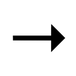
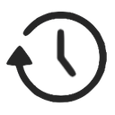
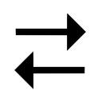
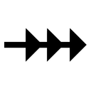
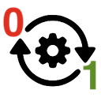

# AR Patterns Catalog

**Catalog of AR Patterns: Event-driven Design Patterns in Creating Augmented Reality Experiences**

This catalog is the main repository of the [AR Patterns](https://github.com/ARpatterns) community. It is split into three parts the [Augmentation Patterns](#behavioral-patterns), the [Behavioral Patterns](#behavioral-patterns) and the description of the overarching [Event-Condition-Action Pattern](eca/).

## Augmentation Patterns
While a VR/3D designer is placing virtual objects using positions in a controlled world coordinate system, 
an AR content creator primarily specifies object placement intents relative to appearing anchors, 
which are dynamically produced by detectors. These spatial anchors serve as reference points for pinning objects. 
Generally in AR Patterns, the augmentation intents are formulated as [Event-Condition-Action](eca.md) (ECA) rules that are triggered by detector events. 
When a detector event occurs, ECA rule’s reaction will add augmentation items to the AR scene.

The following table outlines several common placement intents for event-driven augmentation patterns 
that can be used to stage AR experiences. In AR, the real world serves as the spatial context for the stage, 
making users both spectators and performers. Their movements and perspectives influence the firing of events, 
leaving limited control over time and space for AR scenography (in contrast to film, theater, and VR/3D/game design).

<h3><i>List of Augmentation Patterns</i></h3>

| Augmentation Pattern	| Description	| Example |
|---|---|---|
| [Geolocated Remark Pattern](augmentation-patterns/geolocated-remark.md)	| Triggering of action or of user feedback based on GPS location data or on address data	| Visual or audio feedback about location-based point of interest | 
| [Segment Overlay Pattern](augmentation-patterns/segment-overlay.md)	| Presentation of 2D overlay on top of image segment detected in video stream	| Attaching 2D text description to a detected image segment | 
| [Area Enrichment Pattern](augmentation-patterns/area-enrichment.md)	| Approximately placing 3D content at area of image segment| Presenting ballons in sky area | 
| [Captured Twin Pattern](augmentation-patterns/captured-twin.md)	| Captured element of real world added to 3D data model	| Captured walls and doors and windows in an indoor AR session | 
| [Anchored Supplement Pattern](augmentation-patterns/anchored-supplement.md)	| Presentation of 3D content aligned to detected entity for enhancement	| Attaching visual 3D elements to a detected image (marker) or captured object | 
| [Superimposition Pattern](augmentation-patterns/superimposition.md)	| Presentation of 3D content replacing a detected entity	| Cover a detected object with a virtual one | 
| [Tag-along Pattern](augmentation-patterns/tag-along.md)	| Presentation of 3D content within user’s field of view while head-locked	| Place 3D control panel that follows the user | 
| [Hand/Palm Pop-up Pattern](augmentation-patterns/hand-palm-popup.md)	| Presentation of 3D content on hand or palm while visible	| Place 3D UI elements at palm of user's one hand | 
| [Ahead Staging Pattern](augmentation-patterns/ahead-staging.md)	| Presentation of 3D content ahead of user	| Placing 3D item on floor in front of spectator | 
| [Pass-through Portal Pattern](augmentation-patterns/pass-through-portal.md)	| Present partly hidden 3D content to force user to go through	| Placing 3D scene behind a portal / behind an opening | 
| [Staged Progression Pattern](augmentation-patterns/staged-progression.md) | Ordered, linear story: temporal order or interaction flow of 3D presentations	| Sequence of 3D content with forth and optionally back movements | 
| [Attention Director Pattern](augmentation-patterns/attention-director.md) | Guide user’s attention to relevant place | Use animated pointers to direct user’s attention |
| [Contextual Plot Pattern](augmentation-patterns/contextual-plot.md) | Spatio-temporal setting that aggregates diverse AR patterns to form a scenario or a non-linear plot | Scenography of dynamic, interactive, and animated AR | 

## Behavioral Patterns
The real world context during an AR session can be seen as stage. The dynamic behavior of an AR experience is determined by its [Event-Condition-Action](eca/) rules, which are triggered by events occurring in the actual real-world context.

<h3><i>List of Behavioral Patterns</i></h3>

| Icon | Pattern | Description | Example |
|---|---|---|---|
|  | [Instant Reaction Pattern](behavioral-patterns/instant-reaction.md)	| Direct execution of action triggered by invocation of rule	| Immediate command of action or call of function |
|  | [Timed Reaction Pattern](behavioral-patterns/timed-reaction.md)	| Temporally executed action	| Delayed action or sequence of timed actions|
|  | [Conditional Reaction Pattern](behavioral-patterns/conditional-reaction.md)	| Execute an action only when a condition is fulfilled after being triggered by event	| State-driven, asynchronous programming logic|
|  | [Continous Evaluation Pattern](behavioral-patterns/continous-evaluation.md)	| Continuous polling of state changes that will triggers rules	|Continuous checks on value change, existence, visibility, proximity |
|  | [Publish-Subscribe Notification Pattern](behavioral-patterns/publish-subscribe-notification.md)	| Receive notifications via a message queue from a subscribed system	| From speech recognition system or from WebRTC system in collaboration session |
|  | [Request-Response Pattern](behavioral-patterns/request-response.md)	| Remote procedure call resulting in asynchronously receiving ECA rules or media assets	| REST API call via a Web URL to load rules or assets (images, 3D models)|
|  | [Chain Reaction Pattern](behavioral-patterns/chain-reaction.md)	| Course of events processed as sequence of indirect reactions of running subsequenced rules	| Rule changing data that will trigger a rule to update an item’s visual as a follow-up |
|  | [Complementary Reactions Pattern](behavioral-patterns/complementary-reactions.md)	| Two active rules with opposite reactions	|Reacting on toggling states with two complementary active rules|
|  | [Detector Reactivation Pattern](behavioral-patterns/detector-reactivation.md)	| Reactivate detector with only-once reaction	|Reactivate detector after resulting augmentation is no longer existing |

## Event-Condition-Action Pattern

To design reactive systems, breaking down the system’s behavior into discrete events, conditions, and actions provides a structured and modular approach.

Description of the [ECA Pattern](eca/)

## AR Pattern Diagram
All of the patterns are documented in a standardized way explained in the [AR Pattern Diagram](https://github.com/ARpatterns/diagram) repository.

## How to Contribute
This is a community-driven catalog, which means we need you as a contributor! Join us in creating new patterns and enhancing the existing ones.
We would love to see more examples of the patterns in use in other technologies.

How to contribute is described in detail here: [Contributing](CONTRIBUTING.md)