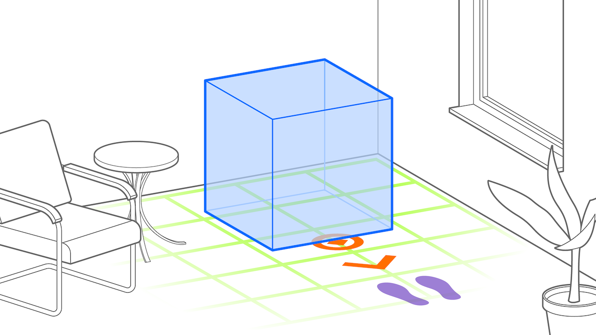

# Ahead Staging Pattern
> Sets up content in front of the user for convenient interaction

## What is the Ahead Staging Pattern?
Ahead Staging is a technique for aligning 3D content with a viewer's position and viewing direction in AR applications. In this technique, virtual content—referred to as an augmentation—is positioned (_staged_) directly in front (_ahead_) of the user when the AR scene begins. This ensures that the augmentation is immediately visible to the user upon scene activation, avoiding issues with content that is positioned outside of the viewers field of view.
The ahead staging pattern refers to the use of the aforementioned technique and applies whenever whenever an augmentation appears in front of the user at the start of the AR experience. This can occur whether the augmentation is automatically _staged_ by the system or if the user is prompted to place it manually within the scene. The orientation of the augmentation does not impact this pattern. Typically, augmentations are placed at a default distance of 1–2 meters (approximately 3–7 feet) in front of the user, using a world-locked anchor that is often aligned with the ground plane. The augmentation may be oriented towards the user, a geolocated reference point (e.g., Mecca), a recognized object (e.g., a chair), a detected feature (e.g., a wall), or another point of reference.
After this initial positioning, users can interact with the augmentation or move freely around it. Since the augmentation is anchored in the world (world-locked), it remains in place, distinguishing the ahead staging pattern from other augmentations patterns, such as the "tag-along" pattern, where the augmentation moves with the user. The ahead staging pattern positions the content initially in front of the user, but once placed, it remains anchored in the world and does not follow the user’s movement.

The Ahead Staging Pattern is useful in a variety of contexts where users can freely place augmentations in their environment, such as furniture, game objects, or animations. Known applications generally use the rear camera with this pattern.

## Requirements
The ahead staging pattern applies whenever AR content is placed in front of the user when an AR scene starts and positioned relative to a world-locked anchor. For world-locked anchoring to work, some form of feature detection is therefore required for this pattern to apply.
It is recommended to prompt users to move their device in order to scan the environment to enable anchoring.

* _Anchored_: any world anchor
* _Placed_: initially ahead of user
* _Aligned_: no impact
* _Camera_: Rear

## Related Patterns
- [**Attention Director Pattern:**](attention-director.md) The attention director pattern is used to draw attention to a specific area in the AR scene. It is often combined with the Ahead Staging pattern.
- [**Tag-Along Pattern:**](tag-along.md) Contrary to the ahead stagining pattern, the tag-along pattern anchors AR content on the user or the AR device, moving—or tagging along—with them. While initial setup may be similar, objects placed with the ahead-staging pattern will remain in place, and not move along with the user.
- [**Tag-Along Pattern:**](tag-along.md)

## Technical Considerations
The ahead staging pattern generally works best if users are allowed to position augmentations themselves, allowing themselves to set the anchor on features that they know are reliable. Therefore, the ahead staging pattern is often preceded by an environment scan, in which the user moves their phone to allow the AR framework to detect environmental features that can serve as anchoring points.
The orientation of the augmentation can be chosen among the following or any additional point of reference.
|  |  |  |  |

## Scenarios and Examples
- Shopping: Placing a piece of furniture in the room before buying
- Gaming: Place game characters, objects or the playing field on a real-world surface.
- Education: Place virtual objects in the real room to experience their size or to examine them in detail

## Event-Condition-Action Diagram
|:---:|:---:|:---:|:---:|
| with object | geo-referenced | towards user | to environment |
