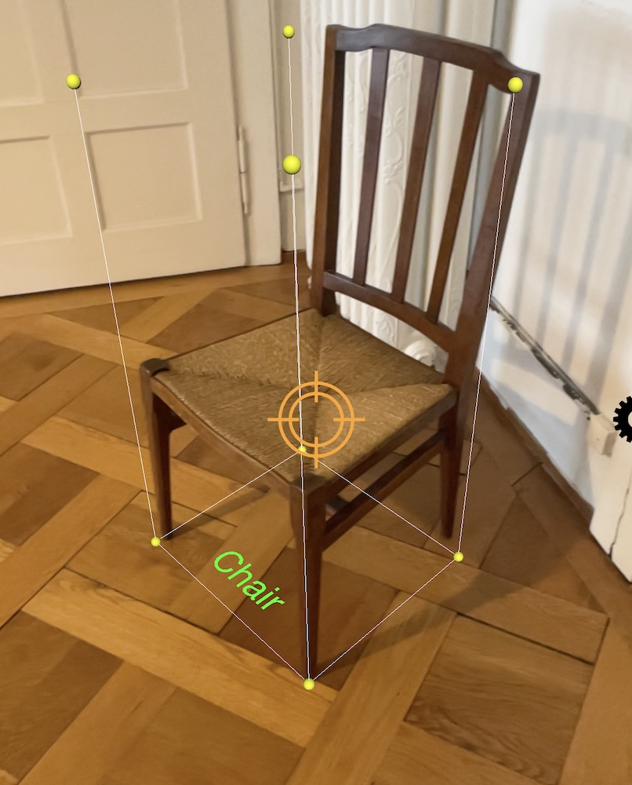
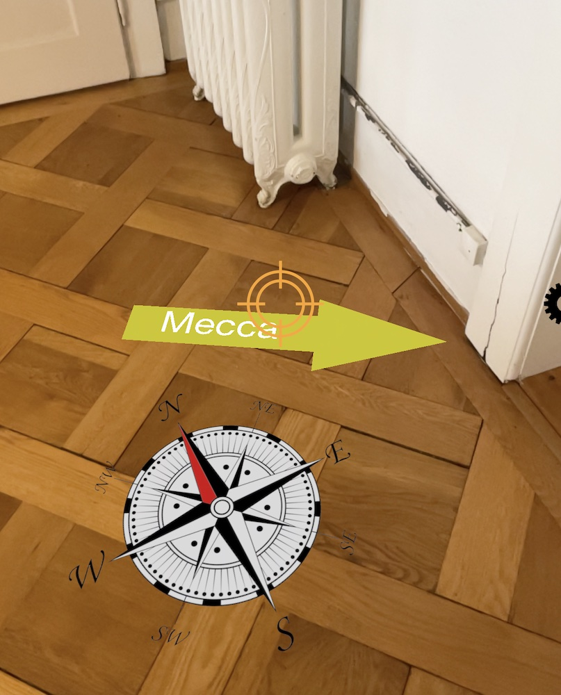
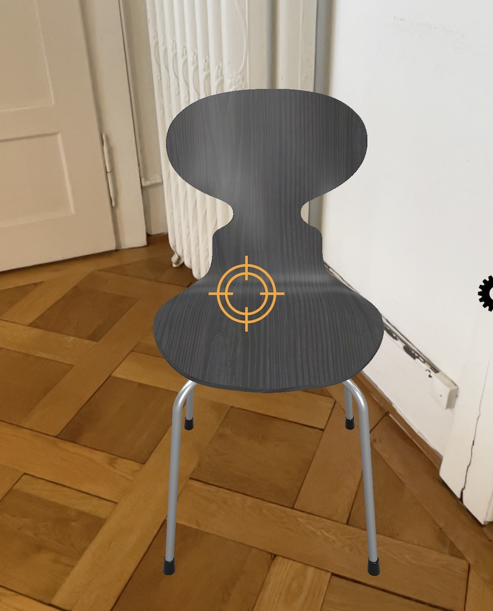
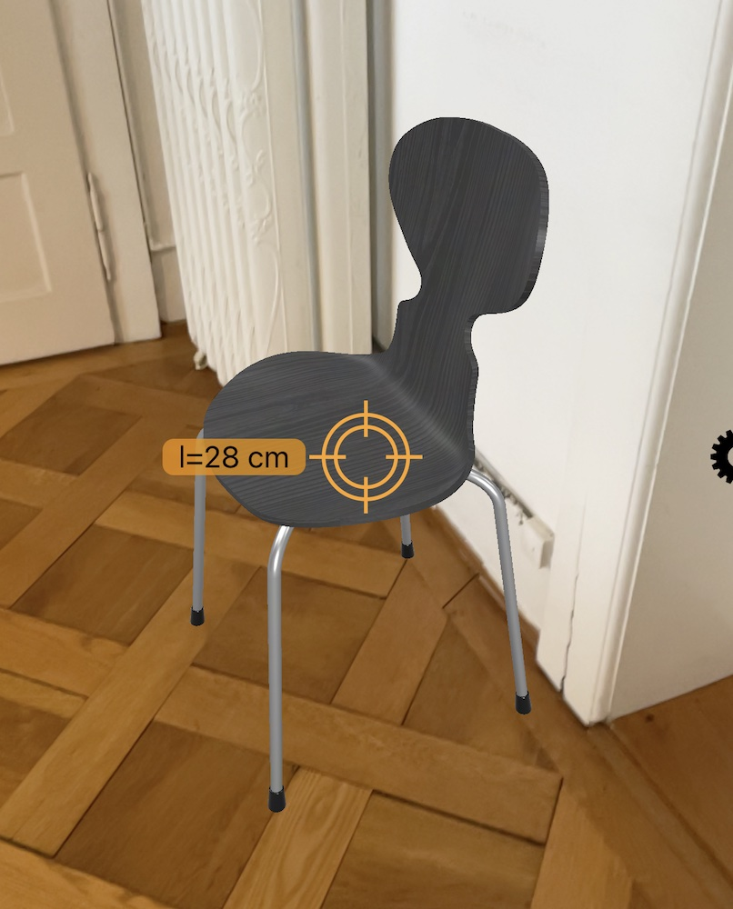

# Ahead Staging Pattern

Ahead staging is a technique for presenting 3D content in a way that it is aligned to spectator’s position and view direction. The scene is launched at a default distance (1–2m) in front of the user using a world-locked anchor, often relative to the ground floor plane. The alignment can be directed towards geolocated references, towards the user, or can also consider nearby objects in the environment. After the initial staging, users can interact with the virtual scene from their current position or move toward and around the staged content.

* _Placed_: initial ahead of user
* _Aligned_: initial towards user, object, or georef

## Alignment of Augmentations in 3D
|  |  |  |  |
|:---:|:---:|:---:|:---:|
| with object | geo-referenced | towards user | to environment |

## Examples

