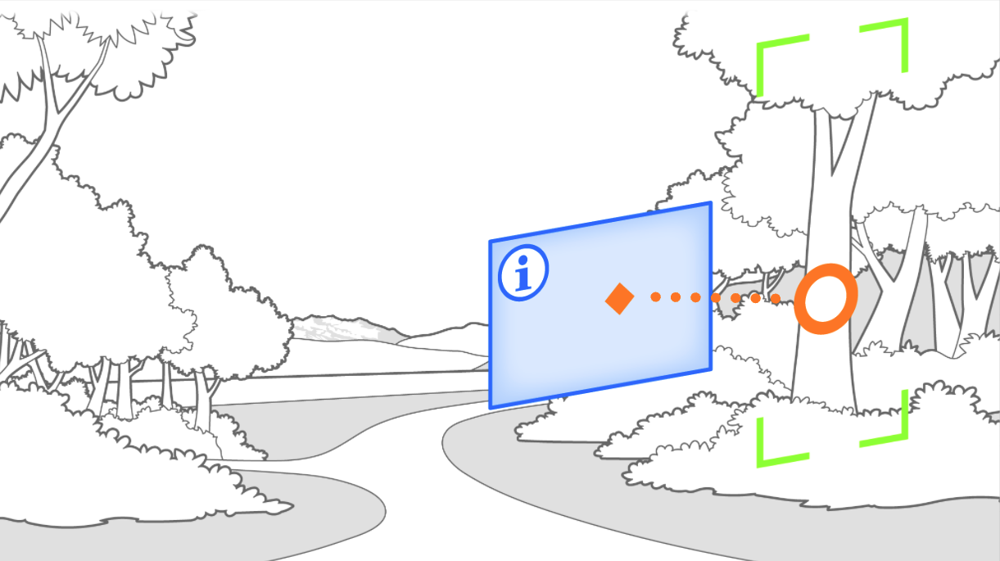
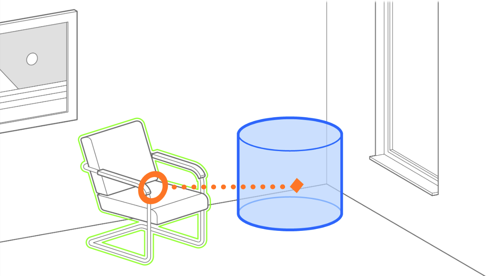

# Anchored Supplement Pattern

> Shows an augmentation next to a detected object or feature

## What is the Anchored Supplement Pattern?
The Anchored Supplement pattern shows an augmentation that adds context to something that was detected. For example, after detecting a famous painting, a description of this painting could be shown next to the painting.

This pattern is applied whenever an augmentation is shown in a fixed spacial relationship to a detected entity. In the example above, the description—i.e. the _supplement_—would be shown next to the detected painting—i.e. the _anchor_.  The anchored supplement pattern has the intention of adding context to real-world entities in order to describe them or otherwise augment them.

The anchored supplement pattern is especially well suited to training and educational applications or may also have its uses in any case where the real world can benefit from contextual augmentations. It is generally used with the rear camera.

**Additional Visualizations**

&nbsp;

## Requirements
The anchored supplement can apply if a specific entity is detected with has a point of origin which can be designated the _anchor_. This allows the relative positioning of the _supplement_. For example, showing a 3D Object anchored in a detected tag constitutes a use of this pattern. 
The anchored supplement pattern requires that the detected entity remain visible and that the supplement be placed at a fixed spacial relationship to it or the user. The anchored supplement is often used in conjunction with AR tags.

* _Anchored_: any detected object or tag.
* _Placed_: relative to object
* _Aligned_: normally user facing or relative to object
* _Camera_: generally rear, front also possible

## Related Patterns
- [**Segment Overlay Pattern:**](segment-overlay.md) When the entity originates from camera image segmentation rather than than the detection of an entity, the segment overlay pattern applies. For example, detecting an image segment as the sky, and then recoloring with AR 
- [**Hand/Palm Pop-Up Pattern:**](hand-palm-popup.md) When the detected entity is a hand or other body part in a mixed-reality context and the goal of the augmentation is to add specific functionality with UX elements, the Hand/Palm Pop-Up Pattern applies.
- [**Superimposition Pattern:**](superimposition.md) If the detected object is to be covered up with a replacement, the Superimposition Patterns applies. For example, if a painting is covered up with another painting. This differentiates it from the anchored supplement pattern, where the detected object should not be covered.  

## Technical Considerations
The anchored supplement pattern is especially useful in conjuction with __AR tags__. It may also be useful in conjunction with various __object or image recognition techniques__. 

In this pattern, issues can arise from the imprecise or ambiguous recognition of objects, tags, or features (anchors). To manage these edge cases effectively, applications should implement context-specific strategies. For example: Should the supplement disappear immediately when the anchor detection stops (e.g., if the user moves the camera away from the anchor), or should there be a delay? Should ambiguous recognition be hidden from the user (i.e., handled transparently), or should the application choose the most likely match instead? For instance, in a plant recognition app, should the user be given the option to choose among several likely matches, or should the most similar option be automatically selected? See examples for strategies applied in various domains (e.g., retail, education).

## Scenarios and Examples
- Shopping: Show price tag and product information
- Museums: Provide contextual information about exhibit or artist
- Manufacturing: Guide product assembly with augmented support information

