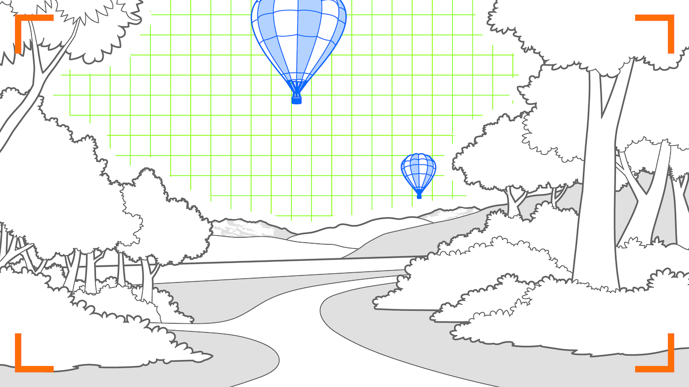

# Area Enrichment Pattern
> Replace parts of the camera image with an augmentation

## What is the Area Enrichment Pattern?

The Area Enrichment pattern is to replace and overlay parts of the camera image with an augmentation.

This pattern applies whenever detected parts of an image (an _area_) is replaced (_enriched_) with an AR augmentation. With the Area Enrichment Pattern the intention is to spacially project 3D content in to the detected area in order to create an alternate reality. However, it is less common than the [Segment Overlay Pattern](segment-overlay.md).

Area Enrichment is a technique which may be encountered in any context where blending reality and AR augmentations are beneficial. For example, virtual backgrounds in conferencing applications or reality-altering effects in photography and video applications are typical applications of the area enrichment pattern. 

## Requirements
The area enrichment pattern requires an image segment (_area_) that can be augmented with AR content (_enrichment_). 
The enrichment is typically aware of the segment's spacial orientation, and uses it to populate the calculated space with virtual items.

* _Anchored_: Not applicable
* _Placed_: on image segment
* _Aligned_: any, but often oriented towards user
* _Camera_: Any

## Related Patterns

- [**Segment Overlay Pattern:**](segment-overlay.md) The segment overlay pattern typically applies for dynamic segments such as faces, text or other image segments that are recognized with image recognition techniques.
- [**Superimposition:**](superimposition.md) If the purpose of the AR augmentation is to superimpose a replacement of a specific object rather than creating a 3D area to populate it with virtual objects, the Superimposition pattern applies.
- [**Anchored Supplement:**](anchored-supplement.md) Anchored supplements differ in two aspects: They do not rely on image segmentation but rather feature recognition, and they never have the intention of replacing content, but rather to supplement it with additional information.

## Technical Considerations

The Area Enrichment Pattern uses detected image segments to calculate the spatial 3D area resulting from perspective projection of the segment into depth of space. The calculated 3D area can then be used to populate the space with virtual items.

## Scenarios and Examples

- Video Conferencing: Virtual Backgrounds
- Video or Photo Effects: Changing scene reality, and combining it with other patterns such as Superimposition, Staged Progression or Ahead Staging.
