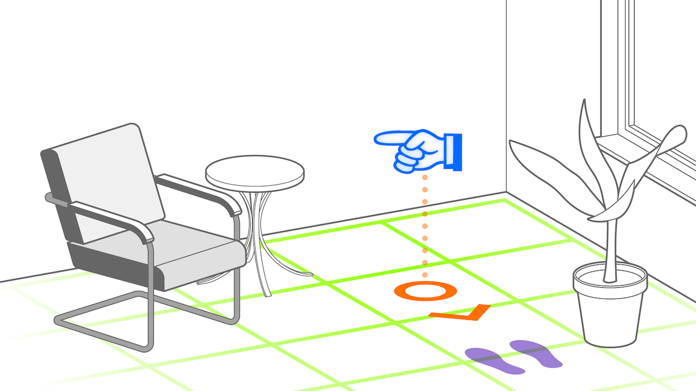

# Attention Director Pattern
> Offer navigational support

## What is the Attention Director Pattern?
An attention director uses animated pointers (bubbles, arrows), light rays, or spatial sound to direct where users should pay attention if the relevant area is not visible or not in focus.

The is especially useful for any kind of navigation use-case. But it is also useful in conjunction with other AR patterns such as the [Geolocated Remark Pattern](geolocated-remark.md), the [Contextual Plot Pattern](contextual-plot.md), the [Ahead Staging Pattern](ahead-staging.md) and [Pass-Through Portal Patern](pass-through-portal.md),the [Pass-Through Portal Patern](pass-through-portal.md) or the [Tag Along Pattern](tag-along.md). All these patterns have in common that they place augmentations in an AR scene which may fall out of the camera's field of view.

The attention director pattern is a very versatile pattern that can be used in almost any context where directing the user's attention is required as the primary use case—such as navigation applications-or to improve usability-such as in conjunction with other AR patterns.

## Requirements

The attention director pattern applies whenever there is a directional indicator in AR that points to the location of a virtual or real entity relative to the current position and orientation of the user's device. 
For example, if an AR augmentation to the right of the smartphone screen's current, the attention director must be able to understand the relative positioning, even if the user's position or the phone's orientation change. Therefore, spacial and rotational awareness is a prerequisite for the pattern to work.
In addition, the directional indicator must initially be placed in ahead of the user in order to be visible. It may then move with the screen (similar to the [Tag Along Pattern](tag-along.md)) or stay in place with a world-locked anchor (Such as in the [Ahead Staging Pattern](ahead-staging.md). However, in the context of this pattern it does not matter if the directional indicator is positioned as a UI element in 2D, as a fake-3D billboard or as a 3D object. 

* _Anchored_: Screen-space or not applicable
* _Placed_: initially ahead of user
* _Aligned_: pointing towards point of interest
* _Camera_: Typically rear

## Related Patterns

- [Tag Along Pattern](tag-along.md) The Tag Along Pattern has the intention of placing an augmentation anchored in the user's position. It is a general pattern for things that follow the user but appear within the AR scene, while the Attention Director pattern may also follow the user, but specifically aims at directing the user's attention.
- [Ahead Staging Pattern](ahead-staging.md) This pattern shares the property of positioning an augmentation ahead of the user, but generally does not have the intention of navigating the user's attention to any specific place. However, once an augmentation is placed, the Ahead Staging Pattern and the Attention Director Patterns are often used together.

## Technical Considerations

The attention director pattern requires that the AR device be aware of it's positional as well as rotional information in order to point into the correct direction. 

Depending on the attention object, the position is either relative to a world-locked anchor or a GPS position. 

Special consideration is required to distinguish two separate cases to achieve good usability: 
* When far from the target: While far, distance indicators help improve orientation, to give the user an indication whether they have to cover distance or whether they are already close.
* When near to the target:  When near the target may just be outside of the camera's viewport. In this case, it is important to display that the target is reached, and to give very precise indication in which direction the camera must be turned to find the target.

Depending on the use case, world tracking or GPS tracking may be better suited.

## Scenarios and Examples
* Navigation: Navigation apps in general are primary uses of this pattern, being able to overlay directional information over the real world, such as in car headboards, phone navigation apps or logistics (picker navigation)

## Event-Condition-Action Diagram
