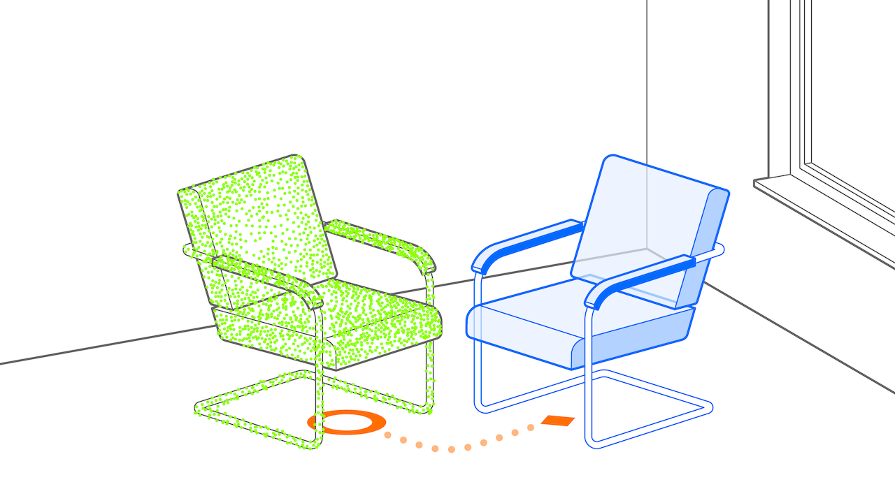

# Captured Twin Pattern
> Scanned virtual replica of a real-world entity

## What is the Captured Twin Pattern?
 
A _captured twin_ is a virtual replica (_twin_) of a physical entity, created using data collected (_captured_) from sensors, cameras, and other sources. This captured data can include geometry, surface textures, and even physical behaviors like movement. The captured twin can be visualized in various ways: as a contour, a transparent 3D bounding box (keeping the real object recognizable), or even a full 3D rendition of the object. Sometimes, the captured twin may not have a visual representation at all but is integrated into the spatial data model (e.g., for collision detection or spatial alignment).

In the example image above, the real object is represented virtually as a point cloud. In contrast, in the [Ahead Staging Pattern](ahead-staging.md), a chair has been detected in the real world and marked with a virtual bounding box and a text label, but the actual captured twin itself is not shown.

The _Captured Twin pattern_ is versatile and fundamental to many AR applications. For instance, it plays a key role in occluding virtual objects behind real-world objects, rendering them invisible when necessary, or enabling collision interactions between virtual and physical objects. It's also central to 3D scanning applications, where capturing the object is the primary goal.

Thus, the main applications of the _Captured Twin pattern_ are often auxiliary to other use cases or patterns.

## Requirements
The Captured Twin pattern applies whenever a model of the real world is captured to be used within an AR application. The intent behind capturing the real-world entity is irrelevant to this pattern. A captured twin can serve different purposes:
- **As an augmentation**: A point cloud or derived 3D model that can be used in conjunction with patterns like the Ahead Staging Pattern, the Superimposition Pattern, or other applicable patterns.
* **As an invisible object for occlusion or collision**: Invisible objects enable more realistic interactions within the AR scene, such as occlusion (blocking the view of virtual objects behind real ones) and collision detection. These interactions can improve the visual credibility of augmented elements by ensuring they behave as if they are part of the real world.

- _Anchored_: to an object or in the world.
- _Placed_: initially on the object.
- _Aligned_: initially with the object.
- _Camera_: typically rear-facing.

## Related Patterns
- [**Superimposition Pattern**](superimposition.md): If the captured twin is rendered above the real object, it can also be considered an instance of the _Superimposition Pattern_. However, while the _Superimposition Pattern_ focuses on covering up a detected object or segment with virtual content, the _Captured Twin pattern_ is primarily about capturing real-world objects to use the collected data in the AR scene.

## Technical Considerations

In most applications, the _Captured Twin pattern_ requires a high level of precision during the capturing process, especially in scenarios like industrial or medical applications. While a camera image may suffice for simple AR tasks, the use of LIDAR sensors or other sensor technologies can greatly enhance precision where accuracy is critical.

## Scenarios and Examples

- **Scanning**: Any AR app that captures real-world objects, such as 3D scanning applications, typically uses the Captured Twin pattern during the scanning process.
- **Gaming**: Mixed Reality (XR) games that combine virtual and real worlds can benefit from the Captured Twin pattern, using invisible twins for better occlusion and lighting effects.
- **Mixed-Reality Headsets**: In any mixed-reality application, the credibility of augmented experiences in the camera pass-through is enhanced by using captured twins to simulate realistic interactions.

