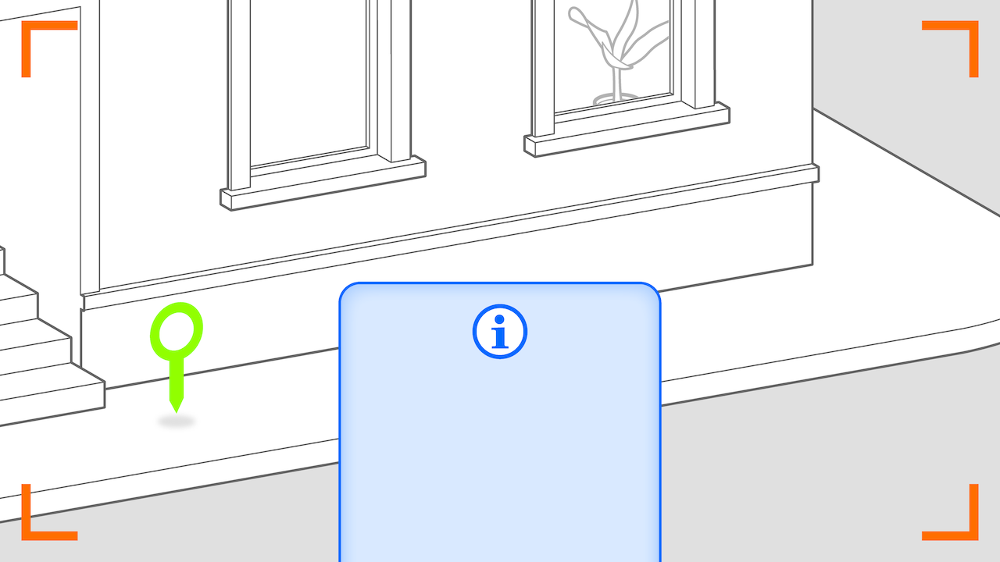

# Geolocated Remark Pattern

A geolocated remark is a rule that is triggered by GPS location data (latitude and longitude) or by address data (i.e., country, city, street, building name). Typically, the reaction to a geolocated remark is presented as text in the 2D user interface or as audio feedback. Due to the precision restrictions of GPS signals, the reaction is not precisely placed in 2D or 3D space.

* _Placed_: no (only as overlay) or ahead of user
* _Aligned_: no or towards user