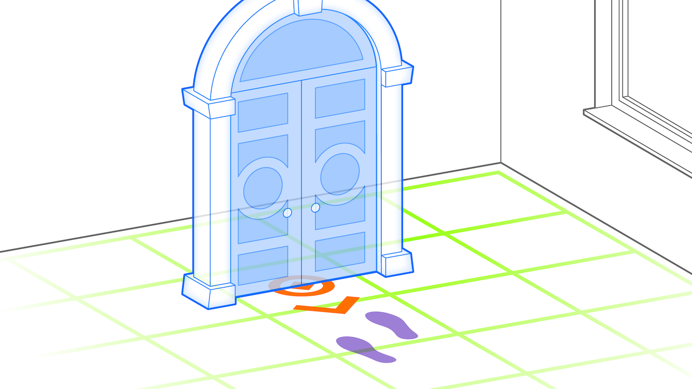

# Pass-Through Portal Pattern

A pass-trough portal is an augmentation that is initially occluded by a virtual object, which prevents the user from seeing the entire scene. This design is intended to encourage users to engage with the experience by requiring them to pass through a gateway to become fully immersed. 

* _Placed_: initially ahead of user
* _Aligned_: initially towards user or object
