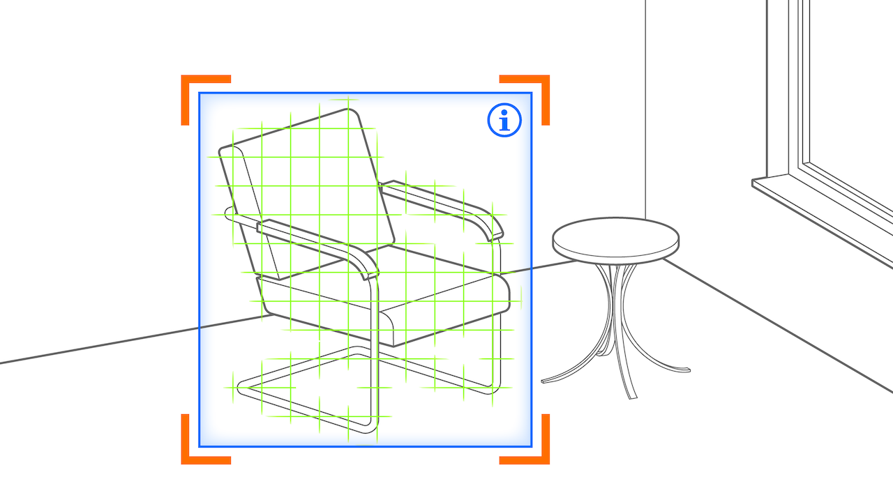

# Segment Overlay Pattern
> Recognize objects or features and augment or replace them

## What is the Segment Overlay Pattern?
The Segment Overlay Pattern applies when parts of an image (_segments_) are _overlaid_ with augmentations. Examples are to change the color of the user's lips in a social media filter, draw bounding boxes around recognized objects in an object recognition app, or highlight detected text in a dictionary app able to recognize text in the real world.
The Segment Overlay pattern is best understood when highlighting its differences with seemingly similar patterns, such as the [Area Enrichment](area-enrichment.md) and the [Superimposition](superimposition.md) patterns. The Area Enrichment pattern has the intention of replacing large areas in the camera image with a 3D-Augmentation to add spaciality, while the Superimposition pattern is usually used with the intention of placing a virtual 3D-Object above a real world object while understanding and matching its orientation. By contrast, the segment overlay pattern often does not try to understand orientation of the object, but instead to infer __meaning__, for example, recognize and track landmarks, body parts or orther image segments. 
The segment overlay patterns is especially useful when the task is to recognize and augment some of the following:
* __point (pixel)__: room corner, object corner, pupil center, ...
* __edge__: horizon line, wall-floor edge, ...
* __bounding box__: depicting rectangle border of detected text, image, face, ...
* __path (open path)__: eyebrow, body skeleton, ...
* __contour (closed path)__: face, mouth, eye, ...
* __image mask__: sky, grass, hair, ...

The Segment Overlay pattern has applications in a wide area of fields, and often complements other augmentation patterns. 

## Requirements
In the AR view, the overlay is positioned based on the pixels relative to the segment within the 2D image, on top of the video stream.

* _Placed_: on screen at image segment
* _Aligned_: flat on top as overlay

## Related Patterns

* [Area Enrichment](area-enrichment.md) The Area Enrichment has the intention of replacing large areas in the camera image with a 3D-Augmentation to add spaciality, for example the background, the sky, or all green pixels, and fills them with an augmentation.
* [Superimposition](superimposition.md) The superimposition is usually used with the intention of placing a virtual 3D-Object above a real world object while understanding and matching its orientation. By contrast, the segment overlay pattern does not have the intention of placing virtual objects, but to alter or augment potentially fine grained areas in a procedural way.
* [Captured Twin](captured-twin.md)The captured twin pattern aims to create a virtual replica of a real object. While capturing the real-world object, the Segment Overlay pattern might be used to help guide users in the scanning step, later transitioning to the Captured Twin pattern.

## Technical Considerations

As all segmentation patterns, the quality of the specific application often hinges on the ability to segment the image: Image processing and recognition techniques therefore. By utilizing computer vision and machine learning techniques, a segment detector can recognize and track designated landmarks and image segments. Examples of the outcomes of the image segmentation are given in the description above.

## Scenarios and Examples
- Medical: Highlight organs, skin anomalities, or other interesting points for diagnostic or surgical purposes.
- Photography or Video: Alter specific aspects of the looks and/or environment, such as changing hair colors, add a smile to face, etc.
- Self-Driving or Driver Assistance: Self-driving heavily relies on recognizing the environment. The result can be used to display in-car AI like highlighting potential dangers, direction signs, speed limits, etc.

## Event-Condition-Action Diagram
