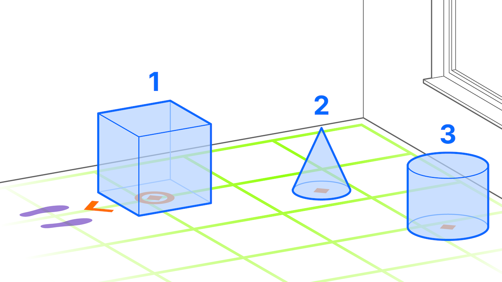

# Staged Progression Pattern

A staged progression refers to presenting a linear story in a structured and sequential manner in AR, with an explicit beginning. This typically involves the ordered presentation of 3D content, which can be unidirectional or bidirectional (going back and forth). The story usually starts staged ahead of the user, but it can also begin at the anchor of a detected entity. The story’s progress is governed by rules triggered by user events, temporal events, or data-driven events.

* _Placed_: initially ahead of user
* _Aligned_: initially towards user or object
