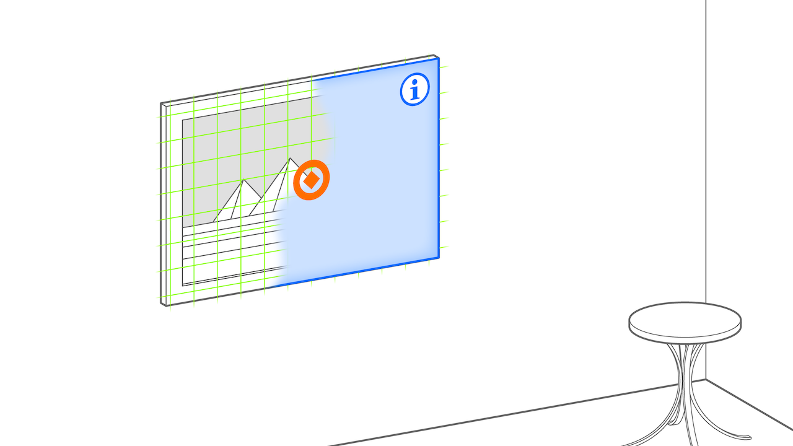

# Superimposition Pattern
> Replace a detected entity with something else

## What is the Superimposition Pattern?
Superimposition aims to cover a detected entity with a virtual one. For example, in an augmented children's book, specific images would be replaced by animated versions of the same image, or if an object is recognized, it could be replaced with a virtual 3D object that hides the real one.

The superimposition is a very frequent pattern in AR, and includes applications employing AR tags, face filters with 3D effects, or any other application where the recognized and covered entity's perspektive and spacial orientation is taken into account to position, scale and rotate the augmentation into place.

The superimposition pattern is useful in a wide array of applications. For example in Applications with AR tags, the tag itself is covered up with the augmentation, but the tag's positional and rotational data is used to place the virtual object. The same applies for face filters where the 3D augmentation (for example the dog's head) covers up the human user's face to create a dog illusion.  It could also be useful for training applications in assembly lines, where the final state of assembly is displayed using perspective information.

## Requirements
The superimposition pattern is applied with the intention of replacing a recognized object with a specific other object. For example, to replace a painting with another painting, to replace an AR Tag with a virtual rendition or augmentation that is anchored in the tag, or to replace a 3d object with a virtual version of itself. 

In its pure form, the superimposition pattern excludes any object scanning, such as it is included in the captured twin pattern. But if it is combined with the captured twin pattern it could include capturing the real-world object before then replacing it with a scanned version of itself. 

* _Anchored_: on object
* _Placed_: on object
* _Aligned_: with object
* _Camera_: Any

## Related Patterns

* [Area Enrichment](area-enrichment.md) While the Superimposition Pattern replaces entities in 3D space with virtual entities, the Area Enrichment pattern replaces entire areas of an image, for example the background, the sky, or all green pixels, and fills them with an augmentation. However, both patterns use spaciality in their augmentations.
* [Segment Overlay](segment-overlay.md) The Segment Overlay patterns differs in general in that it does not take into account the spacial orientation of the image segment, i.e. the part of the image that is covered up by an augmentation often do not share their positioning. Face Swap filters for example only work well if both faces are oriented the same way, and are a typical application of the segment overlay pattern.
* [Ahead Staging](ahead-staging.md) The ahead staging pattern places augmentations in relation to world-locked anchors. It does not share the Superimposition Patterns intention of covering up anything, instead focusing on a user-friendly placement of augmentations in an AR scene, like placing virtual furniture in the user's living room in a shopping app. 
 
## Technical Considerations
Tracking instability can be an issue with the Superimposition Pattern, leading to jitter. The pattern presupposes that the spacial orientation of the entity to be replaces is known in order to ensure a stable orientation of the augmentation. Using a low-pass or a more advanced Kalman filter can improve tracking stability, as can taking external measures such as improving lighting, camera quality, relying on multiple tags instead of just one and infer orientation from their relative positioning, or the use of AI solutions. The more processing is applied, the more power consumption and battery drain may become an issue.

Especially with tag-based AR applications, tag design plays a big role: Ensureing the tag's orientation can be inferred in an unambigious way is key to ensuring tracking stability.

If image segmentation is used instead of tags, ensuring robust object recognition presents a major challenge.

## Scenarios and Examples
- Social Media Face Filters to replace the user's face with a virtual replacement face.
- Games in which real-world tags are used to bring in game objects into play.
- Shopping apps may use this pattern for virtual-try on scenarios, where users may wish to see if a piece of clothing fits them before buying.

## Event-Condition-Action Diagram
