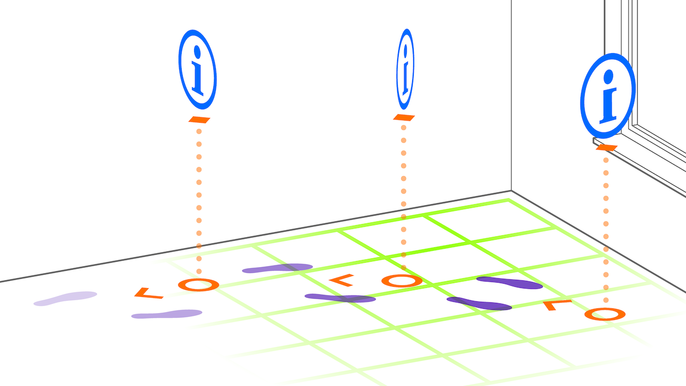

# Tag-Along Pattern
> An augmentation that moves together with the user

## What Is The Tag-Along Pattern?

An augmentation following the _Tag-Along_ pattern always moves together with the user (it _tags along_). Typically, such an augmentation also always attempts to stay within the user’s view range. The main advantage of tag-along augmentations is that they ensure the presented interaction elements are always visible and easily accessible to the user.

A _Tag-Along_ augmentation is typically oriented towards the user’s position, centered on the user's face or device, using billboarding techniques. User interface components in AR applications are a typical example of this pattern: These UI elements must stay within the user's view range while also being located within the AR scene.

In AR applications for head-mounted displays, tag-along augmentations are usually designed to fit within the user’s arm-length range, ensuring they can interact with the elements without stretching or straining themselves.

## Requirements

_Tag-Along_ augmentations move with the user and are attached to the user's position within the AR scene, facing the user's face or, more generally, the camera. This ensures the augmentation stays within the user's view. Depending on the application, the augmentation may mirror the user's movements more or less closely.

We differentiate between two types of movement constraints:

- **_Synchronized_**: The augmentation always mirrors the user's look-at direction, as if the user were wearing a head-mounted display. This is useful in games, such as first-person shooters, where the augmentation needs to move fluidly with the user’s perspective.

- **_Free_**: The augmentation stays in place within the scene even when the user moves their head up or down (y-axis), tilts (yaw), or rotates. The user may manually reposition the augmentation or simply turn back to where it was positioned. This _free_ behavior, which is independent of head movement, is helpful in applications like 3D design, where the augmentation should not obstruct the user’s view but can be repositioned when needed.

_Tag-Along_ augmentations are not used in every scenario where something moves with the user. For example, a virtual dog walking beside the user is better suited for the [**Ahead Staging Pattern**](ahead-staging.md) and [**Captured Twin Pattern**](captured-twin.md), as the virtual dog adjusts to environmental features (ground, walls, etc.) and is anchored in the scene, not to the user.

- _Anchored_: on user
- _Placed_: constraint ahead of the user
- _Aligned_: facing toward the user
- _Camera_: rear-facing

## Related Patterns

- [**Hand/Palm Pop-Up Pattern**](hand-palm-popup.md): While also primarily useful for UI components, this pattern attaches elements to the user's hand instead of centering them on the user's position.
  
- [**Ahead Staging Pattern**](ahead-staging.md): In the _Ahead Staging Pattern_, augmentations are initially placed ahead of the user, but they are world-locked and do not move with the user. See the virtual dog example in the [Requirements](#requirements) section for a more detailed explanation.

## Technical Considerations

Designing _Tag-Along_ augmentations presents several technical challenges because their frequent use in AR, XR, and VR applications has created high expectations for usability. A _Tag-Along_ augmentation stays with the user and is not world-locked but is attached to the scene’s camera. Some key considerations include:

- **Scene Interactions**: Typically, _Tag-Along_ augmentations do not collide with the environment or respond to scene lighting. To ensure that UI elements remain visible, it’s important to treat _Tag-Along_ augmentations separately from the rest of the AR scene by always drawing them on top of other content. They should also avoid responding to scene lighting to remain optimally readable. However, in entertainment apps where visual consistency is key, these augmentations might break immersion, and a narrative reason may need to explain their presence (e.g., attached to a helmet). In some cases, in-scene lighting might be used to help them blend better into the environment.

- **Movement Constraints**: It’s essential to decide how closely the augmentation mirrors the user’s movements and to what degree it is constrained. _Synchronized_ constraints, where the augmentation follows the user's look-at direction, can help in games, while _free_ constraints, where the augmentation remains stationary as the user moves, are useful in design programs. UI elements typically remain upright, avoiding tilt along the x- and z-axes to help the user maintain orientation. The position along the y-axis is also often constrained, keeping the augmentation at a comfortable level (e.g., hip or face level), even if the user bends or crouches.

- **Presence**: Users need clear feedback to understand which UI element or scene they are currently interacting with. Visual cues, haptics, and sound are essential in ensuring smooth interactions. For example, the concept of [tomato presence](https://ieeexplore.ieee.org/document/10108763) ensures that users know which button they are pointing at before accidentally pressing it. Similarly, haptics and audio feedback can assist users in navigating the interface and enhance their sense of presence.

## Scenarios and Examples

- **User Interfaces**: The "Near Menu" UX component of the [Mixed Reality Toolkit](https://learn.microsoft.com/windows/mixed-reality/mrtk-unity/mrtk3-overview) is a good example of the _Tag-Along_ pattern, where menus remain within the user's view and are easily accessible at all times.

- **Gaming**: In first-person shooter games, HUD elements that follow the player's movement and remain visible in their field of view use the _Tag-Along_ pattern to ensure quick access to important game information without obstructing the player’s view of the game world.

- **Design Applications**: In 3D design apps, the _Tag-Along_ pattern can be used for tool menus that are kept accessible but can also be moved or hidden to prevent cluttering the user’s workspace.
