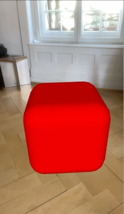
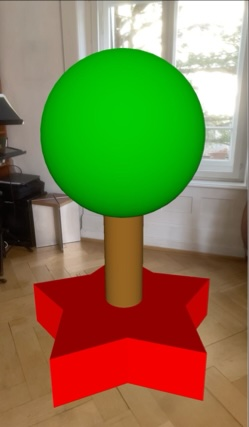
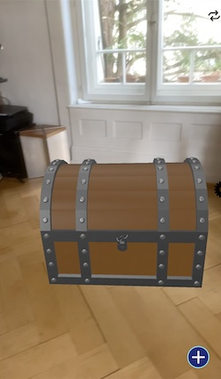

# Ahead Staging Pattern

Ahead staging is a technique for presenting 3D content in a way that it is aligned to the spectator’s position and view direction. After the initial staging, users can interact with the virtual scene from their current position or move toward and around the staged content.

___NOTE___: Try out the examples. Open `aheadStaging.arproject` in [ARchi Composer]() for browsing, editing, and live-injecting the code from your Mac to the [ARchi VR App](https://archi.metason.net) on your iOS device.

## Instant Ahead Staging



### AR Patterns

_Behavior_
* [Instant Reaction](../../../behavioral-patterns/instant-reaction.md): Immediate execution of the staging ahead action

_Augmentation_
* [Ahead Staging](../../../augmentation-patterns/ahead-staging.md): presenting 3D object `red.box`1.5 m  in front of the user
  * Placed: initial ahead of the user on the floor
  * Aligned: initial towards the user in view direction 

### Diagram

 | on:command |  &rarr; | do:add ahead 0 0 -1.2 |
 |---|---|---|
> 'red.box' ➕

### Code

```json
{
  "$schema": "https://service.metason.net/ar/schemas/action.json",
  "items" : [
    {
      "attributes" : "color:#FF0000; wxdxh:0.55x0.55x0.55; ratio:0.2",
      "id" : "red.box",
      "subtype" : "Cube",
      "type" : "Geometry"
    }
  ],
  "tasks" : [
    {
      "do" : "add",
      "id" : "red.box",
      "ahead" : "0 0 -1.2"
    }
  ]
}
```

### Links

* Detailed Docu: [docs/instantStaging.md](docs/instantStaging.md)
* Source Code: [actions/instantStaging.json](actions/instantStaging.json)

## Multiple Ahead Staging



### AR Patterns

_Behavior_
* [Instant Reaction](../../../behavioral-patterns/instant-reaction.md): Immediate execution of a sequence of staging ahead actions.

_Augmentation_
* [Ahead Staging](../../../augmentation-patterns/ahead-staging.md): presenting three 3D objects 1.5 m in front of the user at differnt heights.
  * Placed: initial ahead of the user. The first on the floor, the others above it.
  * Aligned: initial towards the user in view direction. 

### Diagram

 | on:command |  &rarr; | do:add ahead 0 0 -1.5 |
 |---|---|---|
> 'red.star' ➕
 
 | on:command |  &rarr; | do:add ahead 0 0.24 -1.5 |
 |---|---|---|
> 'brown.cylinder' ➕
 
 | on:command |  &rarr; | do:add ahead 0 0.72 -1.5 |
 |---|---|---|
> 'green.sphere' ➕

### Code

```json
{
  "$schema": "https://service.metason.net/ar/schemas/action.json",
  "items" : [
    {
      "attributes" : "color:#FF0000; wxdxh:1.1x1.1x0.25; rays:5; ratio: 0.6",
      "id" : "red.star",
      "isLocked" : true,
      "subtype" : "Star",
      "type" : "Geometry"
    },
    {
      "attributes" : "color:#996622; wxdxh:0.2x0.2x0.5",
      "id" : "brown.cylinder",
      "isLocked" : true,
      "subtype" : "Cylinder",
      "type" : "Geometry"
    },
    {
      "attributes" : "color:#00CC00; wxdxh:0.75x0.75x0.75",
      "id" : "green.sphere",
      "isLocked" : true,
      "subtype" : "Sphere",
      "type" : "Geometry"
    }
  ],
  "tasks" : [
    {
      "do" : "add",
      "id" : "red.star",
      "ahead" : "0 0 -1.5"
    },
    {
      "do" : "add",
      "id" : "brown.cylinder",
      "ahead" : "0 0.24 -1.5"
    },
    {
      "do" : "add",
      "id" : "green.sphere",
      "ahead" : "0 0.72 -1.5"
    }
  ]
}
```

### Links

* Detailed Docu: [docs/multipleStaging.md](docs/multipleStaging.md)
* Source Code: [actions/multipleStaging.json](actions/multipleStaging.json)

## Indirect Ahead Staging



### AR Patterns

_Behavior_
* [Conditional Reaction](../../../behavioral-patterns/conditional-reaction.md): Pressing the overlay button (+) in the bottom right corner sets a data flag. If the data flag becomes the value of 1 the ECA rule is executing the ahead staging action that places the 3D object into the scene.

_Augmentation_
* [Ahead Staging](../../../augmentation-patterns/ahead-staging.md): sdsdfdsff
  * Placed: initial ahead of the user in different heights.
  * Aligned: initial towards the user in view direction.

### Diagram

 | on:command |  &rarr; | do:add |
 |---|---|---|
> 'overlay.button' ➕
 
 | as:stated | if:`data.flag == 1`| do:add ahead 0 0 -1.5 |
 |---|---|---|
> 'wooden.chest' ➕
 
### Code

```json
{
  "$schema": "https://service.metason.net/ar/schemas/action.json",
  "items" : [
    {
      "asset" : "https://service.metason.net/ar/content/assets/3D/chest.usdz",
      "attributes" : "wxdxh:0.77x0.58x0.56;",
      "id" : "wooden.chest",
      "subtype" : "Interior",
      "type" : "3D Object"
    },
    {
      "asset" : "https://service.metason.net/ar/extension/images/plus.png",
      "attributes" : "right:20;bottom:20;width:40;height:40;",
      "content" : "on:tap= assign('data.flag', 1)",
      "id" : "overlay.button",
      "subtype" : "Image",
      "type" : "Overlay"
    }
  ],
  "tasks" : [
    {
      "do" : "add",
      "id" : "overlay.button"
    },
    {
      "as" : "stated",
      "if" : "data.flag == 1",
      "do" : "add",
      "id" : "wooden.chest",
      "ahead" : "0 0 -1.5"
    }
  ]
}
```

### Links

* Detailed Docu: [docs/indirectStaging.md](docs/indirectStaging.md)
* Source Code: [actions/indirectStaging.json](actions/indirectStaging.json)

## References

- ARchi VR [Technical Documentation](https://service.metason.net/ar/docu/)
- ARchi VR [App](https://archi.metason.net)
- AR Pattern [Diagram](../../../diagram)
