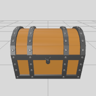

# actions/indirectStaging.json

## Items 

__1__:  &nbsp; &nbsp; __2__:  &nbsp; &nbsp; 

__1 'wooden.chest'__  🔓
- 3D Object.Interior
- https://service.metason.net/ar/content/assets/3D/chest.usdz
- wxdxh:0.77x0.58x0.56;

__2 'overlay.button'__  🔓
- Overlay.Image
- https://service.metason.net/ar/extension/images/plus.png
- right:20;bottom:20;width:40;height:40;
- on:tap= assign('data.flag', 1)

## Tasks 

 | on:command |  &rarr; | do:add |
 |---|---|---|
> 'overlay.button' ➕
 
 | as:stated | if:`data.flag == 1`| do:add ahead 0 0 -1.5 |
 |---|---|---|
> 'wooden.chest' ➕
 

## References 

__Code Refs__

- actions/indirectStaging.json

__Asset Refs__

- _Item asset:_ https://service.metason.net/ar/content/assets/3D/chest.usdz
- _Item asset:_ https://service.metason.net/ar/extension/images/plus.png

__Technology Refs__

- _Technical Documentation :_ https://service.metason.net/ar/docu/
- _AR Pattern Diagram :_ https://github.com/ARpatterns/diagram
- _ARchi VR App :_ https://archi.metason.net
