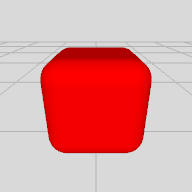

# actions/instantStaging.json

## Items 

__1__:  &nbsp; &nbsp; 

__1 'red.box'__  🔓
- Geometry.Cube
- color:#FF0000; wxdxh:0.55x0.55x0.55; ratio:0.2

## Tasks 

 | on:command |  &rarr; | do:add ahead 0 0 -1.2 |
 |---|---|---|
> 'red.box' ➕
 

## References 

__Code Refs__

- actions/instantStaging.json

__Technology Refs__

- _Technical Documentation :_ https://service.metason.net/ar/docu/
- _AR Pattern Diagram :_ https://github.com/ARpatterns/diagram
- _ARchi VR App :_ https://archi.metason.net
