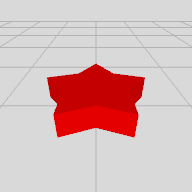
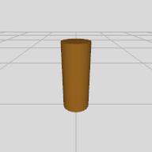
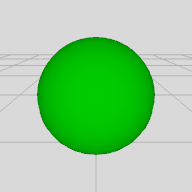

# actions/multipleStaging.json

## Items 

__1__:  &nbsp; &nbsp; __2__:  &nbsp; &nbsp; __3__:  &nbsp; &nbsp; 

__1 'red.star'__  🔐
- Geometry.Star
- color:#FF0000; wxdxh:1.1x1.1x0.25; rays:5; ratio: 0.6

__2 'brown.cylinder'__  🔐
- Geometry.Cylinder
- color:#996622; wxdxh:0.2x0.2x0.5

__3 'green.sphere'__  🔐
- Geometry.Sphere
- color:#00CC00; wxdxh:0.75x0.75x0.75

## Tasks 

 | on:command |  &rarr; | do:add ahead 0 0 -1.5 |
 |---|---|---|
> 'red.star' ➕
 
 | on:command |  &rarr; | do:add ahead 0 0.24 -1.5 |
 |---|---|---|
> 'brown.cylinder' ➕
 
 | on:command |  &rarr; | do:add ahead 0 0.72 -1.5 |
 |---|---|---|
> 'green.sphere' ➕
 

## References 

__Code Refs__

- actions/multipleStaging.json

__Technology Refs__

- _Technical Documentation :_ https://service.metason.net/ar/docu/
- _AR Pattern Diagram :_ https://github.com/ARpatterns/diagram
- _ARchi VR App :_ https://archi.metason.net
