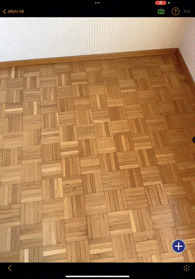

# Button places Box
> ARchi VR

Pressing the overlay button in the bottom right corner (+) sets a data flag that is listened to by a rule that places the box.



## Diagram
| on:command |  &rarr; | do:add |
|---|---|---|
> 'overlay.button' ➕

| on:tap | → | do:assign |
|---|---|---|
> data.flag = 1
 
| as:stated | if:`data.flag == 1`| do:add ahead 0 0 -1 |
|---|---|---|
> 'redBox' ➕

## Code
```json
{
    "$schema": "https://service.metason.net/ar/schemas/action.json",
    "items": [
        {
            "attributes": "color:#FF0000; wxdxh:0.4x0.4x0.4",
            "id": "redBox",
            "subtype": "Cube",
            "type": "Geometry"
        },
        {
            "id": "overlay.button",
            "type": "Overlay",
            "subtype": "Image",
            "asset": "https://service.metason.net/ar/extension/images/plus.png",
            "content": "on:tap=function('data.flag', 'assign:', 1)",
            "attributes": "right:40;bottom:40;width:60;height:60;"
        }
    ],
    "tasks": [
        {
            "do": "add",
            "id": "overlay.button"
        },
        {
            "as": "stated",
            "if": "data.flag == 1",
            "do": "add",
            "id": "redBox",
            "ahead": "0 0 -1"
        }
    ]
}
```