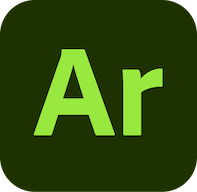
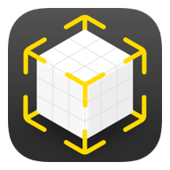

# Technology Platforms

List of technology platforms showcasing AR patterns (in alphabetic order).

## Adobe Aero

- _Software Stack_: [Adobe Aero](https://www.adobe.com/products/aero.html)
- _Supported Devices_: handheld iOS devices (iPhones, iPads)
- _Editor Environment_: [Adobe Aero](https://www.adobe.com/products/aero.html) for iOS, Mac (Beta), and Windows (Beta)
- _Development Method_: declarative no-code using Trigger-Action lists
- _AR Patterns Examples_: tbd

 

## Apple Reality Composer

- _Software Stack_: [Apple Quicklook](https://developer.apple.com/augmented-reality/quick-look/) presenting [USDZ](https://openusd.org) documents with AR extensions
- _Supported Devices_: handheld iOS devices (iPhones, iPads), Apple Vision Pro
- _Editor Environment_: [Reality Composer](https://developer.apple.com/augmented-reality/tools/)
- _Development Method_: declarative no-code using Trigger-Action lists
- _AR Patterns Examples_: [https://github.com/ARpatterns/AppleRealityComposer/](https://github.com/ARpatterns/AppleRealityComposer/)
  
## ARchi VR

- _Software Stack_: [ARchi VR](https://archi.metason.net) App with [DeclARe](https://service.metason.net/ar/docu/) scripting
- _Supported Devices_: handheld iOS devices (iPhones, iPads)
- _Editor Environment_: [ARchi Composer](https://service.metason.net/ar/docu/#archi-composer)
- _Development Method_: declarative low-code using Event-Condition-Action rules
- _AR Patterns Examples_: [https://github.com/ARpatterns/declare/](https://github.com/ARpatterns/declare/)